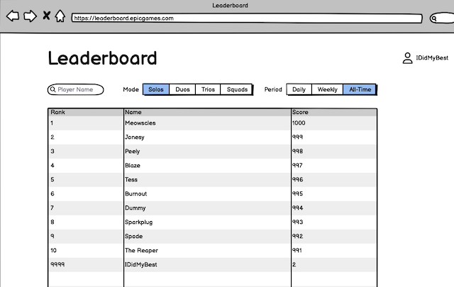
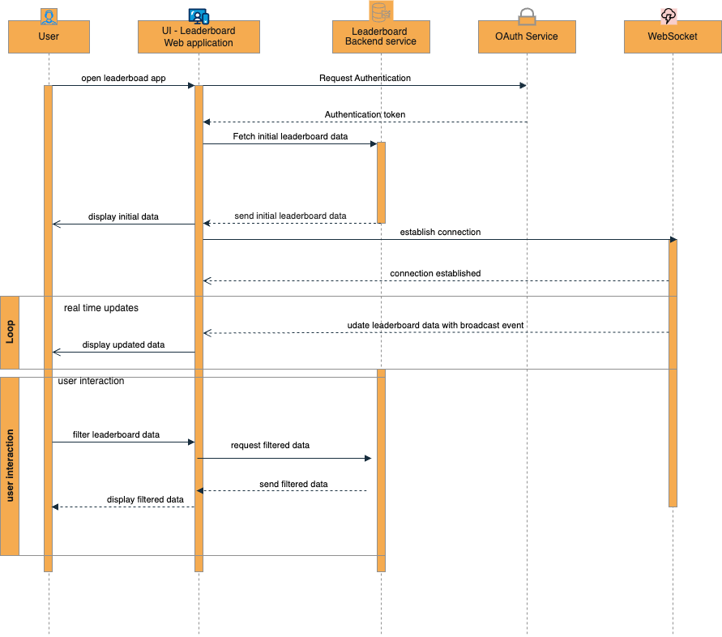

# Leaderboard Application
> Technical Design Doc

## Summary
The aim of this document is to provide architecture design guidance on how to build the leaderboard web application. The goal is to be
able to provide a web application that display a comprehensive player ranking based on total number of eliminations across various game mode.
### Background
<!---
Provide a brief summary to set context for this document
--->
The Leaderboard web application is a web application for showcasing player rankings based on total number of eliminations across various game modes [solos, duos, trios, squads].
This web application will display real-time leaderboard data to users,ensuring that user can get their ranking compared to other users. This will enhance player
experience and boost their engagement with gamers community by sharing their achievements
### Problem statement
<!---
Provide a brief statement of the features of this solution and the primary challenges being addressed by the design
--->
The developed web application must be able to effectively display ranking bases on player eliminations across all the games played,handle easily real time leaderboard data updates
and provide and engaging user experience.
The primary challenges includes:
- Ensuring the UI is responsive and user-friendly
- Managing state and data consistency across different game mode and periods
- Providing a search feature that is efficient, fast, and accurate

## Keywords
The keywords "MUST", "MUST NOT", "REQUIRED", "SHALL", "SHALL NOT", "SHOULD", "SHOULD NOT", "RECOMMENDED", "MAY", and "OPTIONAL" in this specification are to be interpreted as described in [RFC2119](https://www.rfc-editor.org/rfc/rfc2119).
<!---
Additional keywords should be defined here.
--->

## Requirements
<!---
Brief list of enumerated requirements this solution must deliver
--->
### Functional requirements
<!---
Briefly list functional behaviors and attributes of this new system.
--->
1. The leaderboard web application should be able to display the following information containing following data:
    - Player name
    - Player rank 
    - Player eliminations 
    - Game mode 
    - Profile picture or avatar
2. The leaderboard web application MUST be able to filter the leaderboard data based on following game modes: solo, duos, trios, squads 
3. The leaderboard web application MUST support filtering data based on following periods:daily, weekly,all-time 
4. The leaderboard web application MUST be able to search for a specific player by name
5. The leaderboard web application SHOULD be able to display the top 10 players for each game mode per page by default
6. In case of no data available, the leaderboard web application MUST display a message indicating that no data is available
7. The leaderboard web application SHOULD update the leaderboard data in real-time without requiring the user to refresh the page
8. The application MUST be accessible and provide responsive design to support various device types
### Non-functional requirements
<!---
Briefly list other performance characteristics and requirements of the new system
--->
1. The leaderboard application MUST provide fast and responsive user experience by ensuring the following
2. The application SHOULD be scalable to handle a large number of concurrent users
3. The application MUST ensure secure communication and data handling, especially regarding user authentication by using Identity team OAuth2 compliant Authorization Server
4. The application MUST be able to handle periodic spikes up to 10x requests 
5. The application SHOULD be Must be able to handle up to 10 million concurrent players and an average of 10,000 game matches ending every minute. 
6. The application SHOULD be maintainable and easy to extend with new features such as pagination, additional filters, and sorting options
## Out of Scope
<!---
Things that are not intended to be defined by this document.
--->
- Backend service such as REST API or GRAPHQL for data retrieval, processing and aggregating leaderboard data. We shall only provide recommendations or suggest a system design architecture
- Game logic or in-game features unrelated to the leaderboard data display.
- Authentication,Authorization and token generation services handled by identity team
- Data storage and management of leaderboard data (we shall provide only recommendations or suggestions)
- Pagination for displayed leaderboard data. This will only be provided as an optional feature in case the data to display may increase according to the requirements
- Accessibility won't be covered in this document for simplicity, but it is a non-functional requirement that should be considered during the development phase
## Architecture/Design
<!---
Description of the architecture and diagrams. Feel free to add additional subheadings as needed, such as Alternatives
--->
### UI Design
<!---
Include any description or wireframe of the solution UI design.
--->
### Initial wireframe

### Improved wireframe

### UI components breakdown

### Empty data component


The UI design will follow the provided wireframe [Leaderboard](assets/Leaderboard.png) and components can be extracted from the provided wireframe like this from top to bottom:
- Main App Component which represent the whole application in the tree
- A header component that contains the application title and profile component
- A profile component that contains the player profile picture or avatar
- A SearchBox component to search for a specific player by name
- Mode filter component to filter the leaderboard data based on game mode
- Period filter component to filter the leaderboard data based on period
- A leaderboard component or datatable component that displays the leaderboard data
- A pagination component to navigate through the leaderboard data ( Optional)
- A component to display a message indicating that no data is available (Provide separate component for this)
- A page display component indicating the current page number and total number of pages (Optional)

### Architecture design
<!---
Include any diagrams and discussion of solution architecture.
--->
Here is a simple representation of the UI components tree:
```
├── main-app component
│   ├── header component
│   │   ├── title
│   │   └── profile component
│   ├── searchbox component
│   └── mode filter component
│   └── period filter component
│   └── leaderboard component
│   └── no data component
├── └── pagination component (Optional)
```
##### **Frontend (Web Application)**
  * A React.js application that interacts with backend services. 
  * Provides the UI components for filtering and displaying leaderboard data as shown in the [above structure](#architecture-design) 
  * Uses WebSockets to handle real-time updates.
##### **Styling & UI component:**
* The app will be styled using tailwindcss and [shadcn](https://ui.shadcn.com) UI library to provide a consistent and responsive design across different devices.
##### **UI Component Optimization:** 
* Implement lazy loading for components to improve initial load times and performance
* Memoize some components to prevent unnecessary re-renders
* Move filtering to the server side ,but we can leverage client caching to improve performance. We can use Libraries like React-Query, Apollo GraphQL Client, or SWR to handle data fetching and caching
##### State Management 
* The components will be connected to a state management library such as Redux or React Context API to manage the application state and data flow.

##### **API Integration:** 
* Axios or Fetch API to communicate with the backend services to fetch leaderboard data

##### **React Time Update** 
For this type of architecture, we have two options to update the leaderboard data in real-time assuming that the server support socket event broadcasting
* Option **#1**
  * Client-Side Setup:
    * Install the Socket.IO client library in your React.js.
    * Use the useEffect hook to establish a connection to the Socket.IO server upon component mount.
    * Listen for socket events that broadcast leaderboard updates.
    * Upon receiving updates, update your component's state and trigger a re-render to reflect the changes in the UI.
  * Server-Side Setup:
    * For this option we are assuming that the backend was built with real-time capabilities using Socket.IO or similar technology

Option **#2**
This option may seem to be simple, but it can be straight forward that relying on the backend changes that may take time to materialize
* Client-Side Setup:
  * We build our React application as normal using the tech and libraries we mentioned above
  * We integrate with one of the cloud real-time database services like Firebase Realtime Database, Supabase, or Convex
  * If leaderboard data changes on the server, the database will trigger an event that the client can listen to
  * We also simplify the backend by removing the need for real-time capabilities
  * The only drawback of this approach is that we are relying on to third party service which may cause vendor locking in future if we want to switch to another service because of some limitations
### Sequence diagrams
<!---
Include any diagrams of flows through the solution such as decision trees or data flow.
--->
**General Flow**
1. User accesses the leaderboard webpage. 
2. Leaderboard web application perform authentication and authorization using the Identity team OAuth2 compliant Authorization Server to get JWT token
3. Leaderboard web application fetches the leaderboard data from the Leaderboard Service
4. Leaderboard Service returns the data to the Leaderboard web application
5. Leaderboard web application displays the leaderboard data to the user
6. Leaderboard web application establishes a socket connection to the server to listen for leaderboard updates
7. Leaderboard Service broadcasts leaderboard updates to the connected clients
8. Leaderboard web application receives the update and updates the leaderboard data in real-time 
9. User selects filters (game mode, period, player). 
10. Web application requests filtered data from the Leaderboard Service 
11. Leaderboard Service fetches and returns filtered data. 
12. Web application displays filtered data.

Here is the sequence diagram that illustrates the flow of the leaderboard web application

### Data models
<!---
Include any data modeling or schemas, including relationships between different data models
--->
The frontend will handle data models corresponding to the API response provided in the API specification
From the given API specification, we can define the following initial data models that can be broken down into interfaces or types in the codebase

**Player data model**
```json
{
  "id": "string",
  "name": "string",
  "profilePicture": "string"
}
```
**Leaderboard data model**
```json
{
  "leaderboard": {
    "gameMode": "string",
    "period": "string",
    "start": "datetime",
    "end": "datetime",
    "entries": [
      {
        "player": "Player",
        "rank": "number",
        "eliminations": "number"
      }
    ]
  }
}
```

**PlayerLeaderBoard data model**
```json
{
  "player": "Player",
  "leaderboards": [
    {
      "leaderboard": "Leaderboard",
      "rank": "number",
      "eliminations": "number"
    }
  ]
}
```


If we consider that we will use Typescript the data models will be defined as interfaces
```typescript

type Period = 'DAILY' | 'WEEKLY' | 'ALL_TIME';

type GameMode = "SOLOS" | "DUOS" | "TRIOS" | "SQUADS"

interface Player {
    id: string;
    displayName: string;
    profilePicture?: string;
}

interface Entry {
    player: Player;
    rank: number;
    elims: number;
}

interface Leaderboard {
    gameMode: GameMode;
    period: Period;
    start: string;
    end: string;
}

interface PlayerLeaderBoard {
    player: Player;
    leaderboards: {
        leaderboard: Leaderboard;
        rank: number;
        elims: number;
    }[];
}
interface LeaderboardData {
    leaderboard: Leaderboard;
    entries: Entry[];
}
```
## Implementation Details
<!---
Detailed description of how to achieve the design, additional diagrams, and analysis can go here. Feel free to add additional subheadings as needed, such as Dependencies and Risks.
--->
### Technology recommendations
<!---
List and explain any proposed technology choices such as languages, frameworks, database technologies, or cloud solutions. 
--->
* **Frontend**: React.js is strong choice for building interactive and responsive user interface. React is first choice mainly due to its
component bases architecture which make it easy to reuse components. Not only this but React also provide a good performance, and it is easy to learn.
Another advantage of React, is its huge ecosystem and community support.
* **State Management**: Redux or React Context API can be used for state management. Redux is a predictable state container for JavaScript apps. 
  It helps you write applications that behave consistently, run in different environments (client, server, and native), and are easy to test.
  React Context API is a way to share state across the component tree without having to pass props down manually at every level.
* **Real-time Updates**: WebSockets for real-time communication.
  There are some cloud service that can help to implement this feature easily like Firebase Realtime Database, Supabase, or Convex
    * Firebase Realtime Database: This is a NoSQL database from Google that is specifically designed for real-time applications. 
    It allows you to store and retrieve data with low latency, making it a good choice for applications that need to update data 
    frequently and see those changes reflected immediately by all users
    * Supabase: Supabase is an open-source alternative to Firebase that provides a suite of tools for building real-time applications.
      Supabase offers real-time capabilities through their Realtime server containers. You'll need to spin up and manage these containers alongside your main Supabase installation
    * Convex : Convex is a real-time database that allows you to build real-time applications without writing any backend code. 
      Convex provides a simple API that you can use to store and retrieve data in real-time, making it easy to build applications that update in real-time
* **Backend**: Node.js with Express for building scalable service that will offer different API to be consumed by the Fronted.We recommend using
GraphQL because of many advantages it offers that we can leverage for this type of application. Here are few benefits we may get by switching to GraphQL
  * **Flexible Queries**: GraphQL allows clients to request only the data they need, which reduce the amount of data to be sent, making the API more flexible for future changes on backend when requirements change
  * **Nested Queries**: GraphQL supports nested queries, allowing clients to fetch related data in a single request, useful when dealing with complex data structures
  * **Strongly Typed Schema**: GraphQL uses a strongly typed schema to define the data structure, which provides a clear contract between the client and server
  * **Real-time Data with subscriptions**: GraphQL supports subscriptions for real-time updates, which is particularly useful for leaderboard web applications that require real-time data updates
* **Database**: PostgreSQL or MongoDB for high performance and scalability.
* **Authentication**: OAuth2 with JWT for secure access, and it is already provided by the Identity team.

### Dependencies
<!---
List any external dependencies of your solution (ie a service with authentication may have dependency on an identity provider)
--->
* OAuth2 compliant Authorization Server for authentication.
* Reliable and scalable database service.
* API Gateway for routing and security ( optional but may be recommended in future)
* WebSocket server for managing real-time connections.
### Monitoring
<!---
Document any metrics or alerting cases to monitor the health of the application.  
--->
For this purpose the following metrics can be monitored:
* **Application Performance metrics (response time, throughput) tools**:
  * Datadog: Provides comprehensive monitoring for SPAs, including real-user monitoring (RUM), frontend error tracking, and performance insights. It helps identify bottlenecks, track user experience, and troubleshoot issues
* **Error rate and logs for debugging**
  * Sentry: Captures and analyzes errors occurring within your React application. It provides detailed error reports with stack traces and helps identify and fix bugs quickly. 
  * Rollbar: It is another alternative to Sentry, it tracks errors and exceptions in your SPA, offering detailed reports and alerting functionalities. It helps diagnose and resolve issues efficiently.
* **Other Monitoring Tools**:
  * Lighthouse: An open-source audit tool that helps evaluate web page performance, accessibility, and best practices. 
  It provides actionable insights for optimizing your SPA. The good thing with it, it comes installed with Chrome DevTools
### Key metrics
<!---
Document key metrics to capture to evaluate user engagement and inform future product development.
--->
* **Number of active users**: This metric will help us to know how may users are actively using our leaderboard services.
* **API response time**: This is a critical metric to capture since it directly impact the user experience.
* **User engagement metrics**: This includes the number of searches, filters, and interactions with the leaderboard data.
* **WebSocket connection metrics**: We would like to monitor the number of active connections, the number of messages sent and received, and the latency of the WebSocket connections.
### Infrastructure Scaling Recommendation
<!---
Document how the application can be scaled to handle increased load.
--->
This section will provide a high-level overview of how the application can be scaled to handle increased load.
To explain this we will use a diagram to illustrate how the application can be scaled horizontally to handle increased load
to avoid making the document long for our readers


Here is the summary of the technologies and services that can be used to scale the application:
* **Infrastructure**: ECS/EKS/App Runner, AWS/GCP Auto Scaling, AWS ELB, Global CDN
* **Database**: 
  * PostgreSQL/MongoDB with Sharding and Replication for optimizing table searches based on period,modes, playerId
  * Replication: We can implement multi-region replication to ensure high availability and low latency for global users
* **Caching**: Redis or Memcached for caching leaderboard data to reduce database load
* **Backend**: We can leverage Node.js, Express, GraphQL , Microservices to build our backend and containerize them using Docker and deploy it on AWS ECS or EKS
* **Frontend**: We can leverage React.js library and other libraries in its ecosystem to build a scalable and maintainable frontend application
* **WebSocket scaling**: To scale WebSocket connections, we can leverage AWS AppSync or any other managed WebSocket service that can handle millions of concurrent connections
* **Static Asset**: AWS S3, CloudFront to store frontend assets and serve them globally with low latency
* **Monitoring**: Even thought this was not indicated in the diagram below, we can leverage tools like Datadog or Sentry for application performance monitoring,
  and AWS CloudWatch for monitoring AWS services and resources.
* **Security**: OAuth2, JWT, Rate Limiting

## Alternative Solutions
<!---
Document any other solutions considered, why they are not preferred, and whether certain conditions may warrant their reconsideration.
--->
* **HTTP Polling**: This is a common approach to real-time updates where the client makes periodic requests to the server to check for updates.The reason it may not be
the preferred solution is that it is inefficient and resource intensive compared to WebSocket
* **Server Sent Event (SSE)**: This is a strong contender but has some disadvantages like it is unidirectional and does not support full-duplex communication like WebSocket

## Open Questions
<!---
List any “known unknowns” that exist in the context of this proposed technical design.
--->
* How frequently should leaderboard data be updated from the game server?
* Will the leaderboard display data increase to the point where we may need pagination ?
* Will leaderboard need a login page or it will be provided as feature within an existing app ?